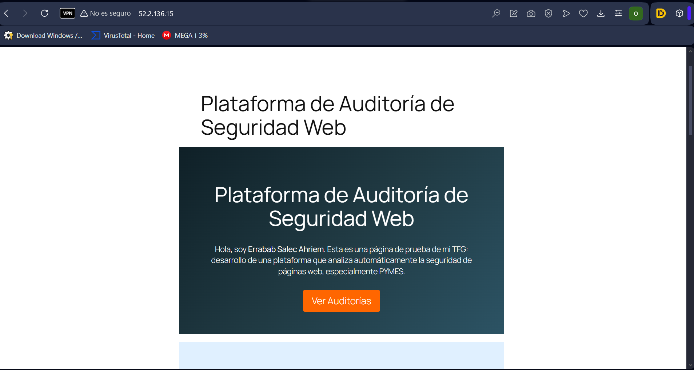
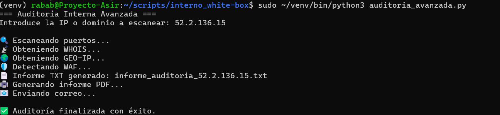

[Volver Atras ](../README.md)

# UD1 – Análisis del entorno y detección de necesidades tecnológicas

## Índice de apartados
1. **Selección de la empresa o contexto de trabajo**
   
    El proyecto está orientado a pequeñas y medianas empresas que utilizan páginas web basadas en WordPress, especialmente aquellas que experimentan:
    * Caídas frecuentes del servicio.
    * Problemas de rendimiento.
    * Sospechas de ataques o actividad anómala.
    * Falta de auditorías previas de seguridad.
    * Necesidad de verificar el estado actual de su sitio web.
    Este tipo de empresas suelen carecer de un departamento especializado en ciberseguridad, por lo que requieren una solución accesible y automatizada que permita evaluar el nivel de seguridad de su web sin depender de herramientas complejas o costosas.

    En este contexto, mi rol consiste en ofrecer un script propio de análisis de vulnerabilidades, diseñado para ayudar a detectar fallos comunes de seguridad en instalaciones WordPress, así como identificar configuraciones débiles, versiones obsoletas, plugins inseguros, accesos expuestos o malas prácticas.

    Para realizar la demostración práctica del proyecto se empleará la web pública del instituto:
    [IES Rodrigo Caro ](https://fprodrigocaro.org/wp2020/), pero para las pruebas del proyecto se ha utilizado un wordpress de mi maquina virtual en aws .

    El análisis se hará únicamente con fines educativos y dentro del marco del ejercicio académico.

2. **Análisis del entorno**
  El entorno sobre el que se plantea el proyecto es el siguiente:

    * Empresas que alojan su web en servidores compartidos, VPS o hosting básico.
    * Instalaciones WordPress con configuraciones diversas, muchas veces sin mantenimiento continuo.
    * Entornos que pueden incluir:
      * Plugins desactualizados.
      * Temas abandonados.
      * Permisos incorrectos.
      * Versiones antiguas de PHP o MySQL.
      * Escaso control sobre logs y eventos.
    * Ausencia de monitorización o sistemas de detección de intrusiones.
  
    El análisis se centra en detectar aspectos críticos como:

      * Versiones vulnerables de WordPress, temas o plugins.
      * Archivos o rutas sensibles accesibles públicamente.
      * Credenciales débiles o accesos no protegidos.
      * Configuraciones inseguras del servidor web.
      * Exposición de información sensible.
      * Rastros de malware o ficheros sospechosos.
  
    El entorno real objetivo —la web del instituto— permite ver un ejemplo de WordPress corporativo con estructura típica y plugins institucionales.
3. **Identificación de necesidades**
    Las necesidades principales que cubre este proyecto son:

    🔐 **Necesidades de seguridad**
       * Conocer el estado real de seguridad de una web WordPress.
       * Identificar riesgos antes de que provoquen incidentes.
       * Obtener un informe claro y útil para tomar decisiones técnicas.
  
    ⚙️ **Necesidades de automatización**
       * Automatizar pruebas técnicas que normalmente requieren varias herramientas separadas.
       * Un script que cualquier usuario pueda ejecutar sin conocimientos avanzados.
       * Reducir tiempos de análisis y evitar errores humanos.
  
    📊 **Necesidades de documentación**
       * Generar informes completos para el cliente.
       * Registrar evidencias mediante capturas y logs.
       * Establecer una base para auditorías periódicas.
  
    💼 **Necesidades del cliente**
       * Disponer de una auditoría inicial sin coste adicional.
       * Tener una visión transparente del estado de su web.
       * Poder reforzar la seguridad sin conocimientos previos.

4. **Guion inicial del proyecto**
    1. Identificación del sitio WordPress a analizar y recopilación de información pública.
    2. Creación del script automatizado que realizará las comprobaciones:
       * Versión de WordPress
       * Plugins
       * Temas
       * Permisos
       *  Archivos expuestos
       *  Puertos accesibles
       * Cabeceras de seguridad
    3. Ejecución del análisis sobre la web del aws.
    4. Recopilación de resultados y generación de informe.
    5. Interpretación de vulnerabilidades encontradas y propuestas de mejora.
    6. Documentación completa del proceso, incluyendo capturas, pruebas y logs.

5. **Capturas y scripts — UD1**
   📷 Captura 1 – Página principal de la web objetivo
        
   📷 Captura 2 – Ejecución inicial del script
        
    📄 Script — analisis_wordpress.py
    [scipt](/scripts/Interno%20(white-box)/auditoria_interna_completa.py)

## Referencias

### Documentación oficial
- OWASP ZAP – Sitio web oficial: https://www.zaproxy.org  
- WPScan – Sitio web oficial: https://wpscan.com  
- Nmap – Sitio web oficial: https://nmap.org  
- Nikto Scanner – Documentación: https://cirt.net/Nikto2  

### Guías y estándares
- OWASP Top 10 – https://owasp.org/www-project-top-ten/  
- Hardening WordPress – https://wordpress.org/documentation/article/hardening-wordpress/  
- Mozilla Web Security Guidelines – https://infosec.mozilla.org/guidelines/web_security  

